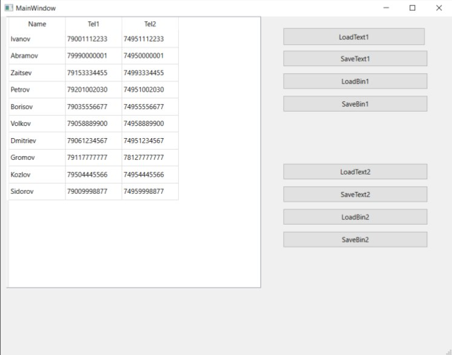

# Qt Template-based Contact Manager (MVC)

Десктопное приложение на C++ / Qt для управления различными типами контактов. Проект демонстрирует уверенное владение паттерном Model-View-Controller (MVC) в Qt, шаблонным программированием, современными стандартами C++17 и бинарной сериализацией данных.

# Стек технологий
* **Язык:** C++17
* **Фреймворк:** Qt Core, Qt GUI, Qt Widgets
* **Паттерны проектирования:** MVC (Custom `QAbstractTableModel`)
* **STL:** `std::sort`, `std::lower_bound`, `std::is_same_v`, лямбда-выражения.

# Архитектура и ключевые решения

### 1. Собственная реализация Table Model (MVC)
Разработан универсальный адаптер `TableModel<T>`, наследующий `QAbstractTableModel`. Модель динамически подстраивает отображение и редактирование колонок в `QTableView` под тип переданной структуры. Маршрутизация типов реализована на этапе компиляции (Compile-time) с использованием C++17 `if constexpr` и `std::is_same_v`.

### 2. Шаблонный контейнер данных
Логика хранения вынесена в шаблонный класс `Solution<T>`. 
* Реализована **Move-семантика** (конструкторы и операторы присваивания перемещением) для оптимизации работы с памятью.
* Имплементирован бинарный поиск по записям с использованием `std::lower_bound`.
* Сортировка данных реализована через передачу лямбда-функций (предикатов) в алгоритм `std::sort.

### 3. Двойная сериализация (Text & Binary)
Реализована перегрузка операторов `<<` и `>>` для потоков `QTextStream` и `QDataStream`. Приложение позволяет сохранять и загружать базы контактов как в читаемом текстовом виде, так и в оптимизированном бинарном формате. Разделение слотов UI-кнопок обеспечивает корректную работу выбранного формата.

